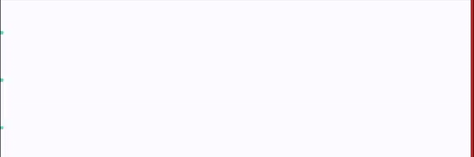

# Exercise-1 Cellular Automata
add desc

## Setup
- Python Version: 3.7
- Required packages are written in <a href="https://github.com/crowdmodeling20ss/exercise1/blob/master/requirements.txt">requirement.txt</a>

## Run Simulation
There is three types of simulation:

### PredefinedSimulation.py
In this type of simulation, settings of the simulation is predefined hard-coded. You just need to choose scenario number for most of the scenarios. 

To run scenarios below, add the scenario number into `scenario.txt`:
- 2: Task 2
- 3: Task 3 equal_block_distance
- 41: Task 4 bottleneck
- 42: Task 4 chicken_test
- 1: Rimea Scenario 1
- 6: Rimea Scenario 6
- 7:Rimea Scenario 7

Then, run the `python Main.py` command. For the Rimea Scenario 4 you need to add two more parameters which are line_movement and density. Line movement could be 0 or 1. Density could be any floating number greater than 0. To run Rimea Scenario 4 with 0.5 density and normal map, your `scenario.txt` should be like that:
```
4 0 0.5
```
If you want to enable line movement, just change 0 to 1:
```
4 1 0.5
```
### ConfigurableSimulation.py
In this type of simulation, settings of the simulation is provided completely by user. Look at the example scenario <a href="">here</a>. After settings are determined in `new_scenario.txt`, the simulation could be run via `python Main.py configurable` command.

Example new_scenario.txt file:
```
Grid Size = (50,150)
Pedestrian = [(10,0),(25,0),(40,0)]
Target = [(0,149),(1,149),(2,149),(3,149),(4,149),(5,149),(6,149),(7,149),(8,149),(9,149),(10,149),(11,149),(12,149),(13,149),(14,149),(15,149),(16,149),(17,149),(18,149),(19,149),(20,149),(21,149),(22,149),(23,149),(24,149),(25,149),(26,149),(27,149),(28,149),(29,149),(30,149),(31,149),(32,149),(33,149),(34,149),(35,149),(36,149),(37,149),(38,149),(39,149),(40,149),(41,149),(42,149),(43,149),(44,149),(45,149),(46,149),(47,149),(48,149),(49,149)]
Obstacle = []
Dijkstra = true
ObstacleAvoidance = true
Speed = [[3,20],[5,20],[7,20]]
```
Example simulation for given scenario:



### UserInterfacedSimulation.py
(not implemented yet)
