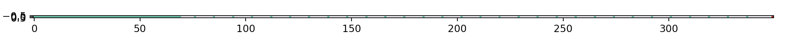

Line movement is test:

with following settings:
MINIMUM_BORDER_LENGTH_SCENARIO_4 = 50
wide_in_m = 6
length_in_m = 70
width = int(wide_in_m * 100 / PEDESTRIAN_SIZE_SCENARIO_4)  # as number of blocks 50
length = int(length_in_m * 100 / PEDESTRIAN_SIZE_SCENARIO_4)  # as number of blocks, 5000
obstacle_locations = []
target_locations = []
pedestrian_locations = []
number_of_pedestrians = int(wide_in_m * length_in_m * density)  # 10 x 1000 corridor
# as number of blocks, 2000 block is 400 meters, all pedestrians will be distributed before the first measuring point
minimum_border_length = int((MINIMUM_BORDER_LENGTH_SCENARIO_4 * 100) / PEDESTRIAN_SIZE_SCENARIO_4)
is_dijkstra = True
is_exit = True
speed = [[7, 20]]
scale_var = 1 #4